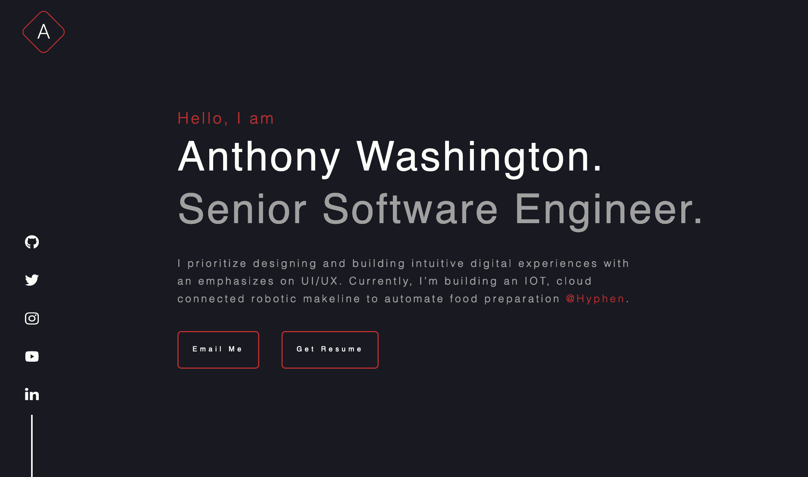

## ⭐️ antdwash.com ⭐️

This is the second iteration of [antdwash.com](antdwash.com) built with:
- [Nextjs](https://nextjs.org/)
- [React](https://reactjs.org/)
- [TypeScript](https://www.typescriptlang.org/)
- [React-Jss](https://cssinjs.org/react-jss)
- [Eslint](https://eslint.org/)
- [Prettier](https://prettier.io/)


[You can view my full design process in figma](https://www.figma.com/file/YRxOcvw7ocvoVhu1zcmPy0/antdwash.com?node-id=0%3A1)


## ⚠️ Please Read ⚠️
I had two goals in mind while creating my personal website:
- give external viewers a quick backstory & overview of my journey
- contribute to opensource by coding in public

You may have a similar goal, as a result, **YES you can use this code for your personal website with attribution**.

I've spent a non-trivial amount of effort designing in Figma and building this website, and I am proud of it! 🤓

All I ask is you not claim this effort as your own and give credit by referencing back to [antdwash.com](https://antdwash.com/)

## 🛠 Install & Setup 🛠

1. Install the correct version of [Node](https://nodejs.org/en/download/)
2. Install the project dependencies
   ```
   yarn install
   ```
3. Start the development sever 
    ```
    yarn dev
    ```
